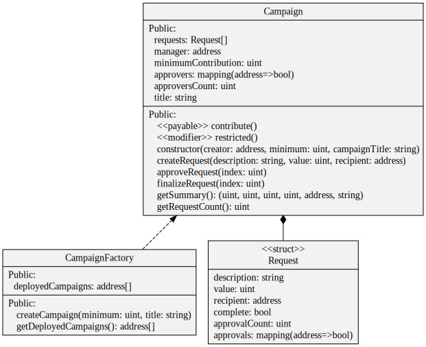

# Kickstart

The project [is hosted here](http://kickstart.decentryfi.xyz). It offers the opportunity to create totally transparent and consensual fund rising campaigns for your projects. Each time someone create a campaign is assigned as **manager** for that campaign. When someone donates to the campaign is considered as a **contributor** which gives the rights to vote for the **spending requests**. Each has one vote per spending request no matters how many times donate to the campaign nor how much that person donated.

At the moment the project will be deployed on [HarmonyOne](https://www.harmony.one/) and [Polygon](https://polygon.technology/).


## Development

To start the project locally you need to install  ```node 14.18.2``` and ```npm 8.1.4``` then you will be able to do an ```npm install``` on the root of the project and finally start the frontend with ```npm run start:ui```.


## Project structure

This project is structured as monorepo including both EVM compatible smart contracts and single page application created with ReactJs.

```
.
├── contracts                # Smart contracts and interfaces
├── public                   # Website public folder used for static assets
├── src
│   ├── assets               # App specific assets like SASS, icons...
│   ├── components           # Generic components code for the website
│   ├── contracts-interfaces # Exported interfaces from smart contracts
│   ├── models               # Generic data models that are used across the app
│   ├── pages                # Components used as individual pages
│   └── services             # Static serices to simplify logic across the app
└── test
    ├── contracts            # Smart contract tests
    └── ui                   # Frontend tests
```

src: `tree -d -A -I node_modules -L 2`

## Smart Contracts

The DEFI app is build out of two smart contracts and a struct:

    - CampaignFactory: used to instantiate Campaigns on blockchain, that way we exclude the possibility that someone can deploy a corrupted campaign.

    - Campaign: contains the logic that make possible to the user and manager to interact the way it was explained on upper sections.

    - Request: structure of data used to have track of the interactions with the Campaign contract.



# User Interface

The user interface implements two blockchain providers, [standard Web3](https://www.npmjs.com/package/web3) provider (read only) and [Metamask](https://www.npmjs.com/package/@metamask/detect-provider) (read and write).

As of my experience using Angular I was influenced on service creation to isolate very specific logic e.g.create a campaign, switch network and isolate Web3 providers. As for the UI components [MaterializeCSS](https://react-materialize.github.io/react-materialize/?path=/story/*) applying the style of [DecentryFi](https://github.com/decentryfi/styleguide).
